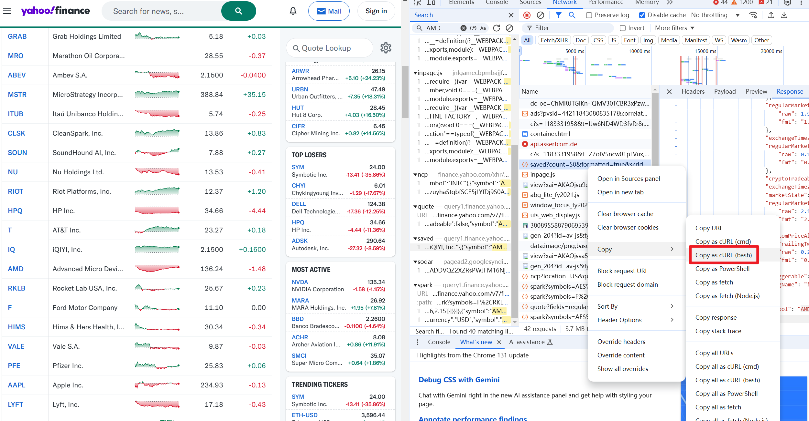

## Some files in the project

### test_request.py

I want to introduce this file. First, you need to get the curl command through the browser developer tools, and then convert it into Python code through the [curl converter](https://curlconverter.com/python/).



This file is used to test the converted Python code, that is, whether the request code can run normally.

### .env

This file is used to store the environment variables required by the project. The environment variables are as follows:

```plaintext
YAHOO_COOKIE="..."
USER_AGENT="..."
CRUMB="..."
```

You can get these values via the <b>Browser developer tools - Network - Headers/Payload</b>.

## Success


